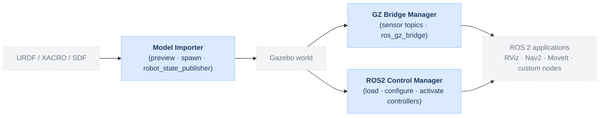

# gz_model_importer

Gazebo Harmonic GUI plugin for ROS 2 Jazzy that imports URDF, XACRO, and SDF models into a running Gazebo world.

## Gazebo ROS 2 Model Runtime Suite

This package is part of the **Gazebo ROS 2 Model Runtime Suite**:

- **[Model Importer](https://github.com/asoriano1/gz_model_importer)** (`gz_model_importer`)
  Imports a model into Gazebo, supports preview, final spawn, and optional `robot_state_publisher` for URDF / XACRO.
- [GZ Bridge Manager](https://github.com/asoriano1/gz_ros2_bridge_manager) (`gz_ros2_bridge_manager`) — discovers active sensor topics and launches ROS 2 bridges.
- [ROS2 Control Manager](https://github.com/asoriano1/gz_ros2_control_manager) (`gz_ros2_control_manager`) — discovers controller managers and provides a UI to load, configure, and activate controllers.

This repository provides the **Model Importer** module.



## What It Does

- Imports local URDF, XACRO, and SDF models into the active Gazebo world
- Creates a preview before the final spawn
- Lets the user set model name, namespace, frame prefix, and pose
- Optionally starts `robot_state_publisher` after importing URDF / XACRO models
- Provides a standard ROS 2 launch entry point that opens Gazebo with the plugin already loaded

## Demo


## Requirements

- Ubuntu 24.04
- ROS 2 Jazzy
- Gazebo Harmonic (`gz-sim8`, `gz-gui8`)
- `xacro` for XACRO inputs

## Build

```bash
cd <workspace>
source /opt/ros/jazzy/setup.bash
colcon build --symlink-install --packages-select gz_model_importer
source install/setup.bash
```

## Recommended Start

Start Gazebo through the package launch file:

```bash
ros2 launch gz_model_importer gazebo_importer.launch.py
```

To open a specific world:

```bash
ros2 launch gz_model_importer gazebo_importer.launch.py \
  world:=/absolute/path/to/world.sdf
```

If `world` is omitted, the packaged demo world `robotnik_world.sdf` is used.

This launch flow:

- opens Gazebo with the Model Importer panel already loaded
- prepares `GZ_GUI_PLUGIN_PATH`
- prepares `GZ_SIM_SYSTEM_PLUGIN_PATH` for `gz_ros2_control` when it is installed
- starts a `/clock` bridge if `ros_gz_bridge` is available

Useful arguments:

- `verbose:=4`
- `paused:=true`
- `gui:=false`
- `bridge_clock:=false`
- `render_engine:=ogre2`

## Manual Gazebo Start

If you want to start Gazebo directly, the package installs a ready-to-use GUI config:

```bash
gz sim \
  $(ros2 pkg prefix gz_model_importer)/share/gz_model_importer/worlds/robotnik_world.sdf \
  --gui-config $(ros2 pkg prefix gz_model_importer)/share/gz_model_importer/config/gz_model_importer.config
```

## Import Workflow

1. Start Gazebo with the launch file above.
2. Click **Browse** and select a `.urdf`, `.xacro`, or `.sdf` file.
3. Review the preview and adjust **Model name**, **Namespace**, **Frame prefix**, and **Pose** if needed.
4. For URDF / XACRO models, leave **Launch robot_state_publisher after import** enabled if you want the TF tree published in ROS 2.
5. Click **Import** to spawn the model into the current world.
6. Use `gz_ros2_bridge_manager` to expose the model's Gazebo sensor topics to ROS 2.

## Notes

- `robot_state_publisher` is available only for URDF / XACRO models.
- Topic bridging is handled by the companion package `gz_ros2_bridge_manager`.

## Author

Ángel Soriano — [Robotnik Automation S.L.L.](https://robotnik.es)
